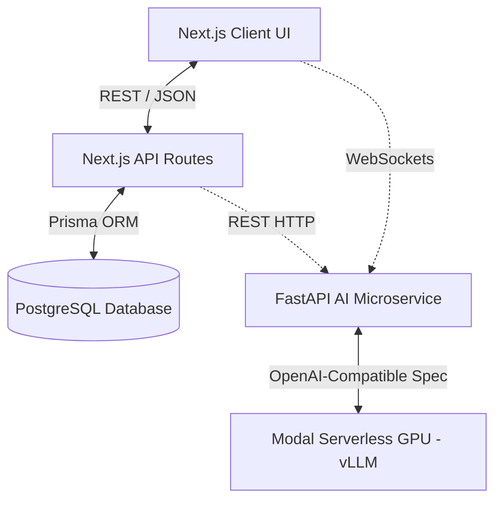

# 2. Architecture Design

## 2.1 Overview
The project strictly enforces a decoupled **microservice architecture**. This separation is crucial to prevent heavy, long-running AI inference tasks (like resume parsing and multi-agent orchestration) from blocking standard web CRUD operations and UI rendering.

## 2.2 Core Components

### 2.2.1 Frontend & Web Routing (Next.js)
* **Framework:** Next.js (App Router recommended).
* **Role:** Handles client-side React rendering, user sessions, and standard application business logic (CRUD for jobs, profiles, etc.).
* **Styling:** Tailwind CSS combined with Shadcn UI components for a modern, accessible interface.
* **Authentication:** Handled via NextAuth.js or similar robust role-based authentication library.

### 2.2.2 Database Layer
* **Engine:** PostgreSQL (hosted on Neon.tech for scalable, serverless deployment).
* **ORM:** Prisma. Provides type-safe database access for the Next.js API routes.
* **Scope:** Manages all persistent relational data (Users, Job Postings, Application Tracking Status, Session IDs).

### 2.2.3 AI Microservice (FastAPI + LangGraph)
* **Framework:** Python / FastAPI.
* **Role:** A dedicated worker service for complex AI tasks. Completely decoupled from the Next.js stack.
* **NLP Pipeline:** 
  * Accepts PDF byte buffers from the Next.js frontend/API.
  * Extracts text and formats it into strict JSON schemas using LangChain and LLM tool calling.
* **Agentic Orchestration:**
  * Uses **LangGraph** to manage the state machine for the mock interview.
  * Manages two distinct personas: **HR Agent** and **Technical Agent**.
  * Maintains conversation memory (`MemorySaver`) tied to a specific session ID.
* **Inference Engine:** Relies on an external LLM (e.g., `google/gemma-4-E2B-it` deployed on a Modal Serverless L4 GPU via vLLM) for high-speed, cost-effective inference.

## 2.3 Communication Protocols
1. **Standard Data (REST):** The Next.js frontend communicates with Next.js API routes via standard REST (`GET`, `POST`, `PATCH`, `DELETE`) to fetch jobs and user data.
2. **AI Processing (REST):** The Next.js API forwards PDF buffers to the FastAPI REST endpoint (e.g., `/api/v1/resume/parse`) and waits for the structured JSON response to save to the database.
3. **Mock Interviews (WebSockets):** To achieve real-time text streaming without HTTP overhead, the Next.js frontend establishes a direct WebSocket connection with the FastAPI backend (`ws://<fastapi-url>/ws/interview/{session_id}`). This bypasses the Next.js API for ultra-low latency AI chat streaming.
